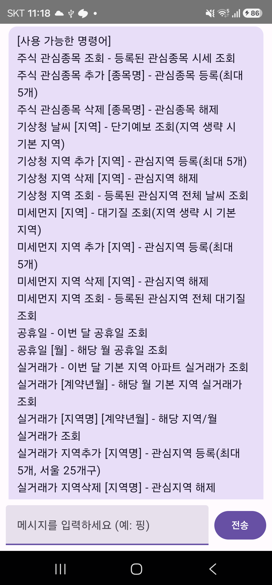

# phoneFlow

> 내 손 안의, 위치를 아는, 공공데이터 전용 Telegram.

phoneFlow는 대한민국 공공데이터포털의 정보를 채팅 한 줄로 바로
꺼내 쓸 수 있게 해주는 Android 앱입니다. 주식 시세, 날씨, 미세먼지,
공휴일, 아파트 실거래가를 물어보면 바로 답해주고, 관심 종목/지역을
등록해두면 조건에 맞을 때 알아서 먼저 말을 걸어줍니다.

내부적으로는 Windows용 자동화 허브인
[NotebookFlow](https://github.com/dorafather/NotebookFlow)와 동일한
C++ Flow DSL 엔진(`libUtil`)을 JNI로 그대로 품고 있는 Android
네이티브 앱입니다 — 같은 시나리오 문법으로 동작하는 자매 프로젝트인
셈입니다.

---

## 핵심 기능

채팅창에 아래 명령어를 그대로 입력하면 됩니다(`help` 입력 시 전체
목록 안내):

- **주식** — 관심종목 시세 조회/추가/삭제(최대 5개), 전일 대비
  등락률이 임계값 이상 변동하면 매일 알림
- **기상청** — 지역별 단기예보 조회, 관심지역 등록 시 강수확률/
  강수 예보 기준 알림
- **미세먼지** — 지역별 대기질 조회, 관심지역 등록 시 통합지수
  나쁨 이상일 때 알림
- **공휴일** — 이번 달/특정 월 공휴일 조회
- **실거래가** — 지역별·월별 아파트 매매 실거래가 조회, 관심지역
  등록(서울 25개구 지원)

  
   
  <code>help</code> 명령어 안내 화면 — 실기기 release 빌드 실측 캡처

> **참고**: 위치 기반 자동 지역 인식(지오펜싱) 등 설계 문서에 남아있는
> 후속 기능은 이번 v1.0.0에는 포함되지 않았습니다(v1.1.0 이후 고려).

---

## 설치 방법

[Releases](../../releases) 페이지에서 최신 `phoneFlow.apk`를
다운로드해 Android 기기에 사이드로딩하세요.

1. 기기에서 APK 파일을 열고 "출처를 알 수 없는 앱" 설치를
   허용합니다(기기/Android 버전에 따라 "설치 중 확인" 또는
   "이 앱만 허용" 안내가 나올 수 있습니다).
2. 설치 후 앱을 실행하면 바로 채팅 화면이 뜹니다. 별도 로그인는
   필요 없지만, 명령어가 실제로 데이터를 받아오려면 아래 3번의
   공공데이터포털 API 키 설정이 먼저 필요합니다.
3. [공공데이터포털](https://www.data.go.kr)에서 무료로 발급받은
   서비스키를 `app/src/main/assets/addr.ini`의
   `service_key=<여기에 입력하세요>` 부분에 채워 넣고 직접
   빌드해야 합니다(배포용 APK에는 보안상 기본값이 비어 있습니다 —
   v1.1.0 이후 앱 내 설정 화면에서 직접 입력하는 방식을 검토 중입니다).

### 소스에서 직접 빌드하기

1. Android NDK(테스트 버전: 23.2.8568313), CMake 3.22.1, JDK 17이
   필요합니다.
2. `local.properties`에 `sdk.dir`를 로컬 Android SDK 경로로
   지정합니다.
3. `./gradlew assembleDebug` (또는 `assembleRelease` — 서명이
   필요하며, 직접 발급한 키스토어를
   `keystore/keystore.properties`에서 읽도록 `app/build.gradle.kts`가
   구성되어 있습니다).

---

## 시나리오 문법

`app/src/main/assets/rest.sce`는 NotebookFlow와 동일한 처리::/
전송::/타이머::/문장:: 블록 문법으로 작성되어 있습니다. 문법 자체에
대한 전체 가이드는 NotebookFlow 저장소의 `CLAUDE.md`를 참고하세요.

## 라이선스

[AGPLv3](LICENSE)
